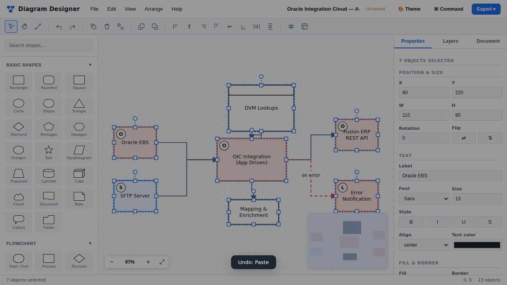

# Enterprise Diagram Designer

A **professional, browser-based diagramming tool** that rivals Microsoft Visio,
draw.io (diagrams.net), and Lucidchart — built entirely with native web
technologies. **No server. No build. No install.** Just open `index.html`.



---

## ✨ Highlights

- **88+ shapes** across 7 libraries — Basic, Flowchart, UML, BPMN 2.0,
  Database/ERD, Cloud & Infra (Oracle, AWS, Azure, GCP, K8s, network), Containers.
- **Infinite canvas** with smooth pan, wheel/pinch zoom, dot/line/none grids,
  snap-to-grid, smart alignment guides, and a live **minimap**.
- **Connector engine** — orthogonal, straight, curved & bezier routing with
  11 arrowhead styles (filled, open, diamond, crow's-foot, UML, …), labels,
  dashed/dotted lines, and animated flow.
- **Full editing** — multi-select, marquee, move, resize, rotate, flip,
  align, distribute, group/ungroup, z-order, duplicate, copy/paste.
- **Context-aware property panel**, **layer manager**, **unlimited undo/redo**.
- **Templates** — Oracle EBS AP Invoice Flow, Oracle Integration Cloud (OIC)
  architecture, swimlane, ER diagram, AWS architecture, mind map, org chart,
  approval flowchart.
- **Import**: JSON, SVG, Draw.io XML, CSV. **Export**: JSON, SVG, PNG (2×/4×/
  transparent), HTML, Print/PDF.
- **Persistence**: autosave to LocalStorage + IndexedDB, recent files, recovery.
- **5 themes** (Light, Dark, Oracle, Microsoft, High-Contrast), **PWA / offline**,
  **command palette** (`Ctrl+K`), and **professional keyboard shortcuts**.

---

## 🚀 Quick start

```text
1. Download / clone this folder.
2. Double-click index.html  →  it opens in your browser. That's it.
```

No web server, package manager, or build step is required. Everything runs
locally in the browser. (Optionally serve it over HTTP to enable the PWA
service worker and full offline install — see the User Manual.)

### Try it in 30 seconds
- Drag a shape from the left palette onto the canvas.
- Double-click the canvas to drop a process box and type a label.
- Pick the **Connector** tool (`C`), hover a shape, and drag from a blue port to another shape.
- Press `Ctrl+K` and type "template" to insert a ready-made diagram.
- Press `Ctrl+E` to export as PNG / SVG / PDF.

---

## 📁 Project structure

```
ClaudeCode/
├── index.html              # App shell (loads ordered ES classic scripts)
├── manifest.json           # PWA manifest
├── sw.js                   # Service worker (offline cache)
├── css/
│   ├── theme.css           # Design tokens + 5 themes
│   ├── layout.css          # App grid & structure
│   ├── components.css      # Reusable UI components
│   └── animations.css      # Motion & transitions
├── js/
│   ├── utils.js            # Namespace + helpers (DOM, math, color, files)
│   ├── eventbus.js         # Observer / pub-sub
│   ├── store.js            # Document model + selection (state layer)
│   ├── history.js          # Undo/redo snapshot engine
│   ├── shapes.js           # Shape registry + factory (88+ shapes)
│   ├── connectors.js       # Routing + arrowhead geometry
│   ├── canvas.js           # SVG render engine + interaction state machine
│   ├── sidebar.js          # Shape palette (search + drag)
│   ├── toolbar.js          # Tools + quick actions + menus
│   ├── properties.js       # Context-aware inspector
│   ├── layers.js           # Layer manager
│   ├── templates.js        # Ready-made templates + gallery
│   ├── storage.js          # Autosave / IndexedDB / recent
│   ├── export.js           # JSON / SVG / PNG / HTML / Print
│   ├── import.js           # JSON / SVG / Draw.io / CSV
│   ├── shortcuts.js        # Keyboard shortcuts
│   └── app.js              # Controller / glue
├── assets/
│   ├── icons/app-icon.svg
│   └── samples/            # Sample project files
└── docs/
    ├── USER_MANUAL.md
    ├── DEVELOPER_GUIDE.md
    ├── TECHNICAL_DESIGN.md
    └── screenshot.png
```

> **Why classic `<script>` tags and a `DD` namespace instead of `import`?**
> Browsers block ES-module `import` over the `file://` protocol (CORS). To honor
> the "just open `index.html`" requirement with **zero build step**, each module
> is an IIFE that attaches to the global `DD` namespace and is loaded in
> dependency order. The codebase stays fully modular; see the Developer Guide.

---

## ⌨️ Key shortcuts

| Action | Shortcut | Action | Shortcut |
|---|---|---|---|
| Undo / Redo | `Ctrl+Z` / `Ctrl+Y` | Group / Ungroup | `Ctrl+G` / `Ctrl+Shift+G` |
| Copy / Paste / Cut | `Ctrl+C/V/X` | Duplicate | `Ctrl+D` |
| Save / Open | `Ctrl+S` / `Ctrl+O` | Export | `Ctrl+E` |
| Command palette | `Ctrl+K` | Print / PDF | `Ctrl+P` |
| Select / Pan / Connector | `V` / `H` / `C` | Fit to screen | `Home` |
| Delete | `Del` | Nudge (×10) | Arrows (`Shift`+) |
| Cycle theme / grid | `T` / `G` | Pan / Zoom | `Space`-drag / wheel |

Full list: **Help → Keyboard shortcuts** or see the [User Manual](docs/USER_MANUAL.md).

---

## 📚 Documentation

- [**User Manual**](docs/USER_MANUAL.md) — install, create, format, export, FAQ.
- [**Developer Guide**](docs/DEVELOPER_GUIDE.md) — architecture, adding shapes/
  templates/connectors, plugins, coding standards.
- [**Technical Design Document**](docs/TECHNICAL_DESIGN.md) — architecture,
  data model, rendering engine, storage design, future roadmap.
- [**Changelog**](CHANGELOG.md) · [**License**](LICENSE) (MIT)

---

## 🧱 Tech stack

Native **HTML5 · CSS3 (Grid/Flex/Variables) · ES2024 JavaScript · SVG ·
Canvas API · Pointer Events · Drag & Drop · IndexedDB · LocalStorage ·
Clipboard API · Service Workers · PWA**. No React/Vue/Angular/jQuery/Bootstrap.

## 🗺️ Roadmap

Real-time collaboration (WebRTC/CRDT), AI-assisted diagram generation,
plugin marketplace, more cloud stencil packs, multi-page documents, and
Visio `.vsdx` import. See the Technical Design Document.

## License

MIT © Enterprise Diagram Designer contributors. See [LICENSE](LICENSE).
