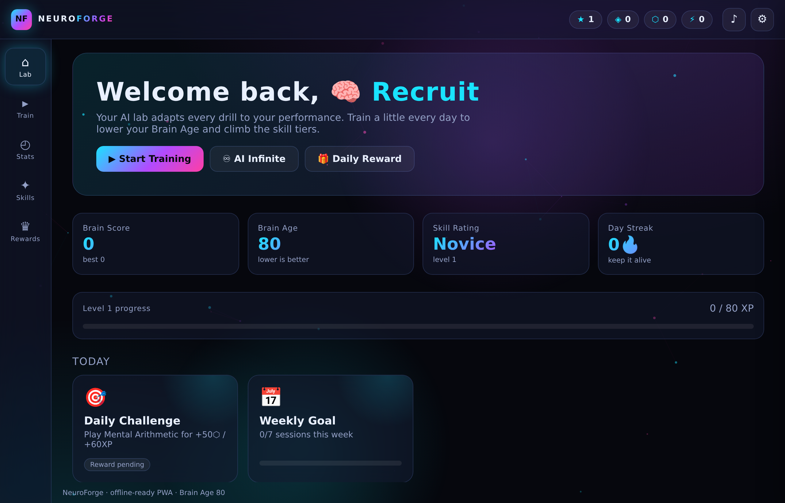

# 🧠 NeuroForge — Brain Training Lab

A production-quality, **fully client-side** brain-training web game with a futuristic
AI-laboratory theme: cyberpunk neon visuals, glassmorphism UI, an animated particle
background, an adaptive "AI" difficulty director, deep player progression, a live
analytics dashboard, synthesized audio, and offline PWA support.

No backend. No build step. No external dependencies. **Just open `index.html` in Chrome.**



---

## ✨ Highlights

| Area | What's inside |
|------|---------------|
| **9 mini-games** | Sequence Memory, Card Matching, Visual Memory, Reaction Time, Mental Arithmetic, Pattern Completion, Schulte Focus, Odd One Out, Maze Navigator |
| **6 training modes** | Memory Master · Logic Arena · Speed Challenge · Math Arena · Observation Zone · Spatial & Strategy |
| **AI Infinite Mode** | Procedurally picks games, biased toward your weaker skills, with nudged difficulty so no two runs feel the same |
| **Adaptive AI** | Per-game difficulty (1–10) adjusts from accuracy, reaction time, win/lose, mistakes & a fatigue estimate |
| **Progression** | XP, levels, coins, Brain Score, Brain Age, Skill Rating, daily login rewards, weekly goal, 14 achievements, unlockable themes |
| **Skill tree** | Spend coins to permanently boost 8 disciplines |
| **Analytics** | Skill radar, accuracy trend, reaction-time graph, daily-activity bars, strong/weak-area detection — all drawn on `<canvas>`, no chart library |
| **Audio** | Web Audio API — every SFX and the ambient music track are **synthesized at runtime** (zero audio files to download) |
| **Accessibility** | 3 themes (Neon / Midnight / Light), colourblind-safe palette, 4 font sizes, reduced-motion mode, full keyboard + mouse + touch controls |
| **Save system** | Auto-save (LocalStorage), plus Export / Import progress as JSON |
| **PWA** | Web App Manifest + Service Worker for installable, offline-first play |

---

## 🚀 Quick start

### Option A — just open it (simplest)
Double-click **`index.html`**, or drag it into Chrome. The whole game runs from the
`file://` protocol because every script is a classic namespaced script (no ES-module
CORS issues).

> The Service Worker / installable-PWA features need `http(s)://`, but the **game itself
> is fully playable from `file://`**.

### Option B — local server (enables PWA + offline install)
```bash
cd brain-training-game

# any one of these:
python3 -m http.server 8080
# or
npx serve .
```
Then open <http://localhost:8080>. Chrome will offer to **Install NeuroForge** as an app.

---

## 🎮 How to play

1. **Lab (home)** — see your Brain Score, Brain Age, streak, daily challenge & weekly goal.
2. **Train** — browse the six modes and pick a game. The chip on each card shows the
   AI-selected difficulty (Warm-up → Elite).
3. Each game tracks **score, combo, lives and time**; finishing awards XP, coins and stars,
   then updates the AI difficulty and your analytics.
4. **Stats** — watch your skills improve over time on the radar and trend charts.
5. **Skills** — spend coins to upgrade disciplines.
6. **Rewards** — track achievements and unlock themes.
7. **♾ AI Infinite** — endless adaptive training that targets your weak spots.

### Controls
- **Mouse / touch** everywhere.
- **Keyboard**: number keys `1–4` pick answers / pads · `Space` for Reaction Time ·
  `Arrow keys` / `WASD` for the maze.

---

## 🧩 Architecture

See [`docs/ARCHITECTURE.md`](docs/ARCHITECTURE.md) for the full breakdown. In short, the
code is modular and decoupled through a tiny event bus:

```
index.html
├── styles/main.css            # themeable design system (CSS custom properties)
├── src/core/
│   ├── util.js                # helpers, hyperscript `el()`, event bus
│   ├── storage.js             # save profile (LocalStorage) + export/import
│   ├── audio.js               # Web Audio synthesized SFX + ambient music
│   ├── background.js          # animated neon particle / lighting canvas
│   ├── adaptive.js            # the "AI" difficulty director
│   ├── progression.js         # XP, levels, brain score/age, achievements, dailies
│   ├── analytics.js           # insights + canvas charts (radar/line/bars)
│   ├── ui.js                  # HUD, toasts, modals, settings drawer, themes
│   ├── screens.js             # the five views (home/play/stats/skills/rewards)
│   └── app.js                 # bootstrap, routing, SW registration
├── src/games/
│   ├── base.js                # GameBase contract + GameHost (game chrome)
│   ├── *.js                   # nine self-registering mini-games
│   └── registry.js            # mode catalogue + AI Infinite picker
├── manifest.webmanifest       # PWA manifest
└── sw.js                      # offline-first service worker
```

**Adding a new game** is intentionally easy — implement a class extending `NF.GameBase`,
call `host.finish({...})` when done, and register it:

```js
NF.games.define({
  id: "my-game", name: "My Game", icon: "🎲", skill: "logic",
  category: "Logic Arena", desc: "…", tags: ["…"],
  create: (host) => new MyGame(host),
});
```
Add its `<script>` tag to `index.html` (and `sw.js` cache list) and it appears in the menu,
gets adaptive difficulty, analytics and progression **for free**.

---

## 📚 More docs
- [Installation guide](docs/INSTALL.md)
- [Deployment guide](docs/DEPLOY.md)
- [Architecture & extension guide](docs/ARCHITECTURE.md)

## 🔒 Privacy
All data (progress, settings, history) is stored **only on your device** via LocalStorage.
Nothing is ever sent anywhere. Export your save any time from **Settings → Export**.

## 🛠 Tech
HTML5 · CSS3 · Vanilla JavaScript (ES2020) · Canvas API · Web Audio API · LocalStorage ·
Service Worker / PWA. Zero runtime dependencies.

## 📄 License
MIT — see headers. Free to use, learn from and extend.
