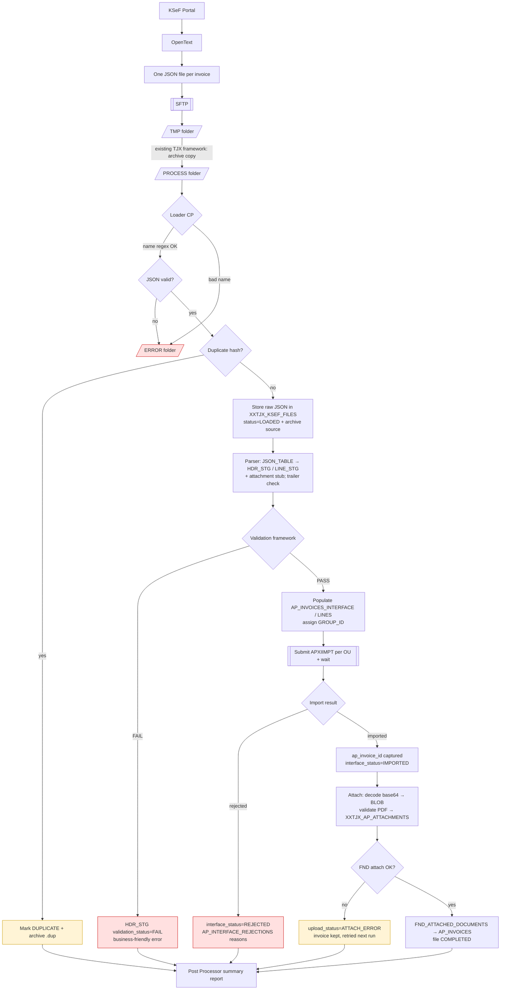
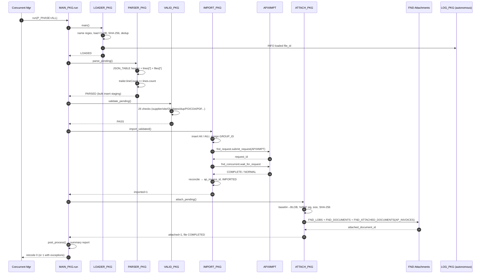
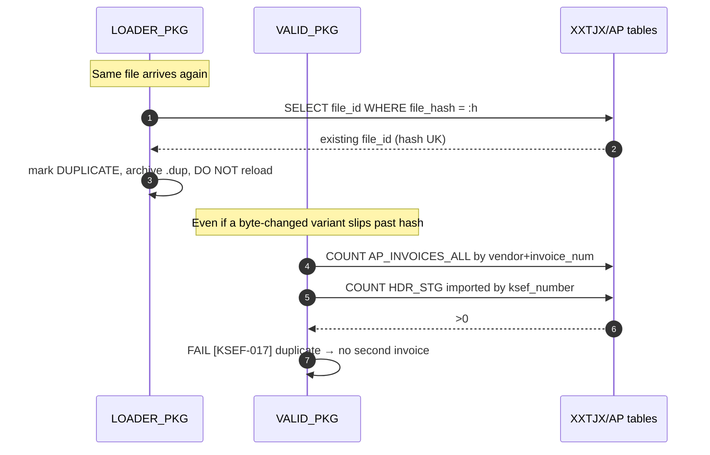
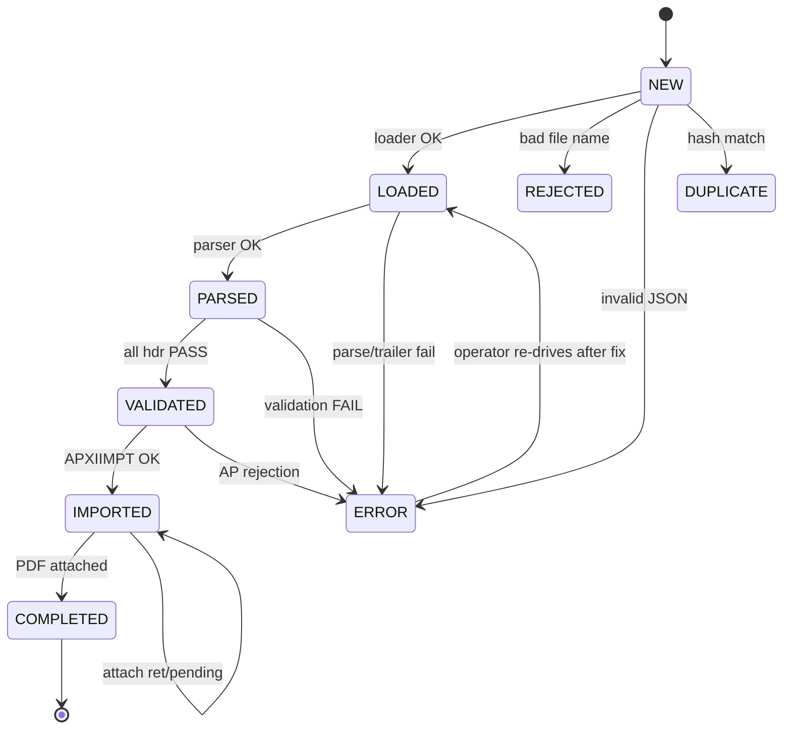

# 02 — Processing Flow & Sequence Diagrams

## 1. End-to-end processing flow

## 2. Sequence diagram — happy path (single file)

## 3. Sequence diagram — replay / idempotency

## 4. Error/exception routing (state)

