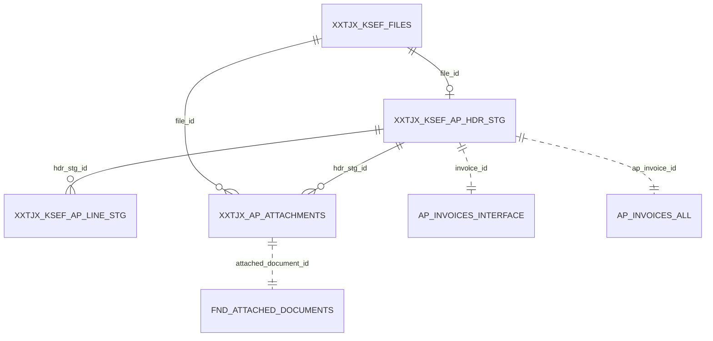

# 03 — Data Model, Index Strategy & Constraints

DDL lives in `../ddl/`. This document is the design rationale + reference.

## 1. Entity relationship

## 2. Tables (summary)

| Table                    | PK              | Key UKs / FKs                                          | LOB                    |
|--------------------------|-----------------|--------------------------------------------------------|------------------------|
| `XXTJX_KSEF_FILES`       | `file_id`       | UK `file_hash`; CK status                              | `file_content` CLOB SF |
| `XXTJX_KSEF_AP_HDR_STG`  | `hdr_stg_id`    | UK (`vendor_site_id`,`invoice_num`,`ksef_number`); FK→files | —                 |
| `XXTJX_KSEF_AP_LINE_STG` | `line_stg_id`   | UK (`hdr_stg_id`,`line_number`); FK→hdr                 | —                      |
| `XXTJX_AP_ATTACHMENTS`   | `attachment_id` | UK (`file_id`,`file_name`); FK→files; CK status         | `pdf_content` BLOB SF  |
| `XXTJX_KSEF_LOG`         | `log_id`        | CK level                                               | —                      |

## 3. Why these constraints

| Constraint                                   | Business purpose                                            |
|----------------------------------------------|-------------------------------------------------------------|
| `xxtjx_ksef_files_uk1 (file_hash)`           | **File-level idempotency** — identical bytes never reloaded |
| `xxtjx_ksef_hdr_stg_uk1 (site,inv,ksef)`     | **Invoice-level idempotency** — replay-safe business key    |
| `xxtjx_ksef_line_stg_uk1 (hdr,line)`         | No duplicate line numbers within an invoice                 |
| `xxtjx_ap_attach_uk1 (file_id,file_name)`    | One attachment row per physical file per payload            |
| CHECK on every `*_status` column             | Guards against illegal state transitions / typos            |
| FKs                                          | Referential integrity across staging lineage                |

## 4. Index strategy

Design goal: every phase's **driver query** is index-driven, no full scans on
the hot path; staging is transient so indexing is deliberately lean.

| Index                          | Serves                                                        |
|--------------------------------|---------------------------------------------------------------|
| `xxtjx_ksef_files_n1 (process_status, received_date)` | Loader/parser "next in status" driver  |
| `xxtjx_ksef_files_n2 (ksef_number)`                   | Idempotency probe (replay lookup)      |
| `xxtjx_ksef_files_n3 (request_id)`                    | Post-processor per-run rollups         |
| `xxtjx_ksef_hdr_stg_n1 (process_status, validation_status)` | Validation/import drivers        |
| `xxtjx_ksef_hdr_stg_n2 (file_id)`                     | Lineage joins                          |
| `xxtjx_ksef_hdr_stg_n3 (group_id)`                    | Import batch build + reconcile         |
| `xxtjx_ksef_hdr_stg_n4 (ksef_number)`                 | Duplicate-invoice validation           |
| `xxtjx_ksef_line_stg_n1 (hdr_stg_id)`                 | Header→line join, interface build      |
| `xxtjx_ksef_line_stg_n2 (file_id, process_status)`    | Line-level status sweeps               |
| `xxtjx_ap_attach_n1 (upload_status)`                  | Attach-phase driver                    |
| `xxtjx_ap_attach_n2 (invoice_id)`                     | Invoice→PDF lookups (support)          |
| `xxtjx_ap_attach_n3 (hdr_stg_id)`                     | Lineage join                           |
| `xxtjx_ksef_log_n1 (request_id, log_date)`            | Per-run log retrieval                  |
| `xxtjx_ksef_log_n2 (file_id)`                         | Per-file troubleshooting               |
| `xxtjx_ksef_log_n3 (log_level, log_date)`             | ERROR triage dashboards                |

*PK/UK indexes are created automatically with their constraints and are not
duplicated above. Standard EBS practice: PK/UK in `APPS_TS_TX_IDX`, LOBs in a
dedicated media tablespace.*

## 5. SecureFile LOB choices

| LOB                            | Settings                                     | Rationale                              |
|--------------------------------|----------------------------------------------|----------------------------------------|
| `XXTJX_KSEF_FILES.file_content`| SecureFile, `COMPRESS MEDIUM DEDUPLICATE`, `NOCACHE` | JSON text compresses well; dedup helps replays |
| `XXTJX_AP_ATTACHMENTS.pdf_content` | SecureFile, `COMPRESS MEDIUM` (no dedup) | PDFs already compressed; dedup wastes CPU |

`ENABLE STORAGE IN ROW` keeps small payloads inline for single-block reads.

## 6. Growth & partitioning (future-proofing)

- Staging is purged (see purge strategy), so it stays small.
- `XXTJX_KSEF_FILES` and `XXTJX_KSEF_LOG` grow with volume. If annual volume
  exceeds ~5M files, **range-partition by `received_date`/`log_date`** (monthly)
  to make purge a partition-drop and keep index B-trees shallow. The DDL is
  partition-ready (no cross-partition UKs beyond the hash, which would become a
  global index).
